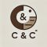

# Coffee & Crochet Website  

## Table of content
* Introduction
* User experience
* Design
* Features
* Testing
* Deployment steps
* Credits

## Introduction
The Coffee & Crochet website is targeted toward people who live in Springfield, who like to socialise with others in the area. The aim is to have people come to meetups at local cafés, to drink coffee and do crochet. Another aim with the website is to encourage people to crochet, by highlighting benefits with needlework. The website is aimed at all individuals located in the area, regardless of age, gender and previous experience with crocheting.
## User experience
### User story

* Goals for a first time visiter
  * I want to know what happens at the meetups.
  * I want to know when and where the meetups take place.
  * I want to know why I should join this community.
  * I want to know if I need to be a professional crocheter to join.
  * I want to easily navigate on the website.

* Goals for a returning visiter 
  * I want to easily check what time the meetup is scheduled a specific day.
  * I want to see images from previous meetups.

* Goals for a frequent visiter  
  * I want a quick overview to make sure that any changes hasn´t been made.

* The website owners goals
  * I want to build a community for the people in the area who crochet.
  * I want to encourage people to crochet.
  * I want to support the local Cafés. 
  * I want to spred knowledge about crocheting
  * I want to make use of patterns and yarn that isnt being used 

## Design
The design of the website is divided into three separated pages for easy navigation. The first page includes all the important information such as an introduction, why crocheting is good for your health and the location and time for the meetups. 

The second page is a gallery with pictures from previous meetups. This page is meant to inspire and attract visitor to join the community. 

The third page contains a form where the visitor can sign up to join the community.

All pages has an navigationbar with links to the different sections. On the bottom on each page there is also links to social media pages.

### Wireframes
The layout of the website was first drawn on a piece of paper. A wireframe of each page was then created in 
[Balsamiq](https://balsamiq.com/).
#### ***Home page***

#### ***Gallery page***

#### ***Join us page***

#### ***Success page***

### Fonts and colour theme
 The font that was choosen was Lora, and Serif as a backup.

 The image on top of the first page was selected first. By using [Colorpicker](https://imagecolorpicker.com/en) a colour palette was set.
 
 From the colour palette, four colours was choosen as a colour theme.

 1. Petrol #516c72
 2. Dark brwon #42352c
 3. Light blue-grey #a3acb9
 4. Light greyish #9d8b86

 ### Images
 All images are downloaded from [Freepik](https://www.freepik.com/). They were all selected to match the content of the website aswell as the colour theme. All images are downsized to fit the purpose of the website.
 The logo is created by [ChatGPT](https://chatgpt.com/).  
 

 A [Favicon](https://favicon.io/) was created based on the letters C and C with the colour theme in mind. 

 ### Text
 The five reasons to do crochet, is also created by [ChatGPT](https://chatgpt.com/). The rest of the text is written by the author.

 ## Features
 ### Navigation bar
 
 The navigation bar is located along the top of the page, on every page. In the navigation bar you can find links to the sections Home, Meetup Times, Gallery and the Join Us form. On the left hand side there is an Coffee & Crochet logo, that takes the visitors back to the top of the first page.
 
On devices with a width of 768px or less, the menu is exchange to a hamburger dropdown menu.

### Footer
In the footer there are social media icons. By clicking on the icons the visitor is being linked to Coffee & Crochet's Facebook, Twitter, Youtube or Instagram. The links opens in a new tab.

### Form
By clicking on the button Join Us, in the navigation bar the visitors get to a form. To submit the form, Name, Email and Phone needs to be filled in. A conformation pages appears when the form has successfully been submitted. This pages contains a button that takes the visitor back to the homepage when being clicked.

## Testing
### Validation
* [HTML Validator](https://validator.w3.org/) has been used frequently throughout the project. Syntax errors has been identified and resolved. Before submission, no errors were found.

* [CSS Validator](https://jigsaw.w3.org/css-validator/) has also frequently been used. Every identified error was corrected before submission.

* Lighthouse testing show good results for speed, accessibility, and SEO.

 
### Responsiveness
The website has been tested on several devices, mobiles, tablets and laptops. It responds as expected on all tested screen sizes. The same goes for different browsers such as Chrome, Microsoft Edge and Safari. 

### Manual testing
Manual testing has been done to both internal and external links. The internal links takes the visitor to the wanted section. The external links opens up a new tag with the wanted website.

## Deployment
1. Go to the **Settings** tab of your GitHub repo.
2. On the left-hand sidebar, in the Code and automation section, select **Pages**.
3. Make sure:
   * Source is set to 'Deploy from Branch'.
   * Main branch is selected.
   * Folder is set to / (root).
4. Under Branch, click **Save**.
5. Go back to the Code tab. Wait a few minutes for the build to finish and refresh your repo.
6. On the right-hand side, in the Environments section, click on **'github-pages'**.
7. Click **View deployment** to see the live site.

## Credits
### Code
All code is taken from Code Institute LMS (Learning Mangement System) and modified to fit the website.
### Content
The font family is from [Google Fonts](https://fonts.google.com/)
The icons in the footer and in the benefits section, were taken from [Font Awesome](https://fontawesome.com/).
### Media
The images of the project on different devices are created on a website called [Are you responsive?](https://ui.dev/amiresponsive)
The logo is made by [ChatGPT](https://chatgpt.com/) and the favicon by [Favicon](https://favicon.io/).

The rest of the images are all downloaded from [Freepik](https://www.freepik.com/).
### Acknowledgements
A special thank you to my mentor for his advice, guidance and support. I also want to thank my brother for his patience and his feedback.
